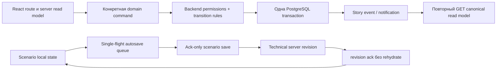

# Уточнённый file-level план Product Reset NewscastNavigator

## Короткий diff-summary

- Принятие плана вынесено в отдельную documentation-only ветку и PR; реализация начинается новым сеансом от `main` после merge.
- Разделены `ANALYZED_PRODUCT_BASE_SHA` и будущий `IMPLEMENTATION_BASE_SHA`.
- Все пути переведены на `$REPO_ROOT`.
- Зафиксирован полный Command API contract, включая атомарный `changes_requested` с непустым списком частей.
- CP1 не изменяет удаляемый `bootstrap.py`; фактический synthetic seed создаётся в CP2.
- В CP7 выделен browser/UX hard-gate с evidence и оценкой 90/100.
- Определён общий тип `MarkRef`.
- Legacy denylist вводится поэтапно: в CP2 разрешён только точный временный editor bridge, в CP3 он окончательно запрещается.
- `mark-aired` разрешён только после успешного внешнего согласования.

## 1. Переносимый корень репозитория и две базы

Во всех командах:

```bash
REPO_ROOT="$(git rev-parse --show-toplevel)"
cd "$REPO_ROOT"
```

Все пути ниже указаны относительно `$REPO_ROOT`.

Read-only проектирование выполнено по:

```text
ANALYZED_PRODUCT_BASE_SHA=5129e0bd19976bbf74ab01aeda9c29663cf152da
```

`IMPLEMENTATION_BASE_SHA` пока неизвестен. Он фиксируется после merge plan PR:

```bash
IMPLEMENTATION_BASE_SHA="$(git rev-parse origin/main)"
```

Оба значения сохраняются отдельно в:

- `$REPO_ROOT/docs/product-reset/PROGRESS.md`;
- `$REPO_ROOT/docs/product-reset/EVAL_RESULT.json`.

## 2. Отдельный этап принятия implementation plan

Этот этап не является реализацией Product Reset.

### Plan commit — `docs(product-reset): add approved implementation plan`

После окончательного текстового утверждения и отдельной команды пользователя:

```bash
cd "$REPO_ROOT"
git fetch origin

PLAN_BASE_SHA="$(git rev-parse origin/main)"
PLAN_WORKTREE="$(dirname "$REPO_ROOT")/NewscastNavigator-product-reset-plan"

git worktree add \
  "$PLAN_WORKTREE" \
  -b docs/product-reset-plan \
  "$PLAN_BASE_SHA"

cd "$PLAN_WORKTREE"
REPO_ROOT="$(git rev-parse --show-toplevel)"
```

Все операции с implementation plan после `git worktree add` выполняются только внутри plan worktree. Исходный checkout больше не используется для записи, проверки, staging или commit этого документа.

Изменяется ровно один файл:

- создать `$REPO_ROOT/docs/product-reset/IMPLEMENTATION_PLAN_RU.md`.

Проверка documentation-only scope:

```bash
cd "$REPO_ROOT"
git diff --check
git status --short
git diff --name-only "$PLAN_BASE_SHA"...HEAD
```

Ожидаемый единственный путь:

```text
docs/product-reset/IMPLEMENTATION_PLAN_RU.md
```

После отдельного разрешения выполняются push и PR. После merge:

1. предыдущий сеанс завершается;
2. открывается новый сеанс;
3. читается новый `main`, уже содержащий утверждённый план;
4. создаётся implementation worktree:

```bash
git fetch origin
IMPLEMENTATION_BASE_SHA="$(git rev-parse origin/main)"

IMPLEMENTATION_WORKTREE="$(dirname "$REPO_ROOT")/NewscastNavigator-product-reset"

git worktree add \
  "$IMPLEMENTATION_WORKTREE" \
  -b feat/product-reset \
  "$IMPLEMENTATION_BASE_SHA"
```

Проверка расхождения с analyzed baseline:

```bash
git diff --name-status \
  5129e0bd19976bbf74ab01aeda9c29663cf152da \
  "$IMPLEMENTATION_BASE_SHA"
```

Если diff содержит только утверждённый `docs/product-reset/IMPLEMENTATION_PLAN_RU.md`, полного повторного проектирования не требуется. Достаточно подтвердить documentation-only diff и начать CP1.

Если появились иные изменения, проводится целевой read-only анализ только изменённых файлов. Полный replan нужен лишь при изменении `SPEC_RU.md`, `EVAL_RUBRIC_RU.md`, редактора, CaptionPanels contract, схемы или runtime-архитектуры.

`IMPLEMENTATION_PLAN_RU.md` не входит в Commit 1.1.

## 3. Архитектурные решения

### KEEP / ADAPT / REPLACE / DELETE

| Область | Решение |
|---|---|
| FastAPI, React, PostgreSQL, SQLAlchemy, Alembic, Docker | KEEP и ADAPT |
| Tiptap, типы блоков, rich text, reorder/duplicate/delete, timecodes | KEEP через characterization-тесты |
| CaptionPanels JSON и стабильные story/segment identifiers | ADAPT без нарушения совместимого payload |
| PBKDF2, signed session tokens, HttpOnly auth-cookie | ADAPT и усилить тестами |
| Монолитные `Project`, `EditorPage`, workspace/current/checked/proofread copies | REPLACE |
| 23 старые миграции | DELETE; заменить одной исходной baseline migration |
| Manual revisions, branch/merge, make-current, text synchronization | DELETE |
| Comments, upload/file storage, DOCX/PDF exports | DELETE |
| Frontend workflow-gates и универсальные status setters | DELETE |
| Корпоративный logo/brand tokens/brand guide | DELETE |
| Root Compose, health, PostgreSQL backup/restore, nginx/systemd | ADAPT |
| Дублирующие compose, native-dev, recovery, exports/storage backup scripts | DELETE |
| `SPEC_RU.md`, `EVAL_RUBRIC_RU.md`, `GOAL_PROMPTS_RU.md`, `AGENTS.md` | KEEP |
| Противоречащая старая документация | DELETE или полная перезапись |

### Целевой поток



Autosave — единственное исключение из `command → refetch`: ack обновляет подтверждённую revision, но никогда не заменяет открытые строки.

### Одна исходная миграция

В CP2 создаётся единственный файл:

- `$REPO_ROOT/backend/migrations/versions/20260710_0001_product_reset.py`.

Он создаёт:

- `users`, `user_functions`, `rubrics`;
- `stories`, `story_assignments`, `story_material_links`, `story_events`;
- `scenarios`, `scenario_rows`;
- `scenario_edit_sessions`, `scenario_revisions`, `scenario_revision_rows`;
- `story_workflow_states`, `story_production_states`, `scenario_read_markers`;
- `correction_packages`, `correction_parts`;
- `external_approval_cycles`;
- `notifications`.

CP3–CP6 не добавляют миграции. Ошибка схемы до принятия CP2 исправляется в baseline с повторной проверкой пустой PostgreSQL.

## 4. Общие API-типы и GET read-models

### Общие типы

```text
UserRef {
  id,
  display_name,
  position
}

RubricRef {
  id,
  name
}

AssignmentRef {
  kind: author | proofreader | video_editor | designer,
  user: UserRef
}

MarkRef {
  revision,
  actor: UserRef,
  at
}

ActionRef {
  code,
  label,
  method,
  href,
  emphasis: primary | normal | danger,
  confirmation: null | string,
  form: null | correction_package | external_result | return_reason
}

StoryHeader {
  id,
  title,
  rubric: RubricRef,
  author: UserRef,
  priority: {code: standard | high, label},
  created_at,
  updated_at,
  situation: {code, label},
  assignments: AssignmentRef[],
  aired_at,
  archived_at,
  priority_action: ActionRef | null,
  primary_action: ActionRef | null,
  additional_actions: ActionRef[]
}

CommandAck {
  ok: true,
  event_id: string | null,
  changed_at,
  resource: null | {
    type,
    id
  }
}
```

Domain error shape:

```text
{
  error: {
    code,
    message,
    details
  }
}
```

Общие ошибки: `AUTH_REQUIRED`, `FORBIDDEN`, `STORY_NOT_FOUND`, `STORY_ARCHIVED`, `INVALID_TRANSITION`, `VALIDATION_ERROR`.

### Главный экран

```http
GET /api/v1/stories
```

Query:

```text
scope=active|archive
search=<title|author|rubric>
rubric_id=<id>
priority=standard|high
area=scenario|video|titles|voiceover|external
mine=true|false
limit=<1..200>
```

Ответ:

```text
{
  items: [{
    id,
    title,
    priority,
    rubric,
    author,
    situation,
    assignments,
    created_at,
    updated_at,
    priority_action,
    archived_at
  }],
  total
}
```

Сортировка: высокий приоритет первым, затем `created_at DESC, id DESC`.

```http
GET /api/v1/stories/create-options
```

Ответ включает доступные сервером `rubrics`, `authors`,
`priority_options` и `create_action`. Leadership получает `Стандарт` и
`Высокий`, остальные пользователи — только `Стандарт`.

```http
GET /api/v1/me/actions?limit=20
GET /api/v1/notifications?unread=true&limit=50
```

### Вкладка «Сценарий»

```http
GET /api/v1/stories/{story_id}/scenario
GET /api/v1/stories/{story_id}/workflow
```

`scenario`:

```text
{
  story: StoryHeader,
  scenario: {
    revision,
    rows: [{
      segment_uid,
      order_index,
      block_type,
      text,
      speaker_text,
      file_name,
      tc_in,
      tc_out,
      additional_comment,
      structured_data,
      formatting,
      rich_text
    }]
  },
  edit: {
    state: available | mine | held | archived,
    edit_session_id,
    holder,
    expires_at
  },
  captionpanels: {
    eligible,
    last_opened_revision,
    changed_since_last_open,
    diff_session_id
  },
  available_actions
}
```

`workflow`:

```text
{
  story_id,
  review_request: MarkRef | null,
  editorial_check: MarkRef | null,
  proofread: MarkRef | null,
  changed_after_proofread,
  reproofread_request: MarkRef | null,
  primary_action,
  additional_actions
}
```

### Вкладка «Производство»

```http
GET /api/v1/stories/{story_id}/production
GET /api/v1/stories/{story_id}/correction-packages
GET /api/v1/stories/{story_id}/external-approval/cycles
```

`production`:

```text
{
  story: StoryHeader,
  assignments,
  materials: [{
    id,
    title,
    location,
    added_by,
    added_at
  }],
  voiceover: {
    ready,
    ready_by,
    ready_at
  },
  video: {
    started_by,
    started_at,
    ready_by,
    ready_at,
    approved_for_titles_by,
    approved_for_titles_at,
    last_opened_revision,
    has_unseen_scenario_changes
  },
  titles: {
    initial_gate_satisfied,
    started_by,
    started_at,
    ready_by,
    ready_at,
    accepted_by,
    accepted_at,
    last_opened_revision,
    has_unseen_scenario_changes
  },
  aired: null | {by, at},
  stages: [{
    code,
    state,
    label,
    summary
  }],
  primary_action,
  additional_actions
}
```

`correction-packages`:

```text
{
  story_id,
  items: [{
    id,
    source: internal | external,
    created_by,
    created_at,
    parts: [{
      id,
      scope: text | video | titles | voiceover,
      description,
      assignee,
      state: pending | done,
      completed_by,
      completed_at
    }],
    all_parts_complete,
    awaiting_leadership_review,
    closed_by,
    closed_at,
    primary_action,
    additional_actions
  }]
}
```

`external-approval/cycles`:

```text
{
  story_id,
  items: [{
    id,
    cycle_no,
    sent_by,
    sent_at,
    result: pending | approved | changes_requested,
    decided_by,
    decided_at,
    correction_package_id
  }],
  primary_action,
  additional_actions
}
```

### Вкладка «История»

```http
GET /api/v1/stories/{story_id}/history?cursor=<opaque>&limit=50
```

```text
{
  story: StoryHeader,
  items: [
    {
      kind: edit_session,
      id,
      actor,
      started_at,
      ended_at,
      from_revision,
      to_revision,
      diff_summary: {added, removed, changed, moved, total},
      diff_href,
      available_actions
    }
    |
    {
      kind: workflow_event,
      id,
      event_code,
      label,
      actor,
      at,
      diff_href,
      available_actions
    }
  ],
  next_cursor
}
```

Autosave revisions и notification delivery в `items` не входят.

## 5. Command API contracts

Во всех таблицах указанные domain errors дополняют общие ошибки.

### Сюжеты, рубрики и пользователи

| Method и path | Минимальный payload | Право | Результат | Domain errors |
|---|---|---|---|---|
| `POST /api/v1/stories` | `{title, rubric_id, author_user_id?, priority?}`; приоритет по умолчанию `standard`, обычный author создаёт для себя и не может выбрать `high`, `chief` может указать другого автора и высокий приоритет | `author` или `chief` | `CommandAck`, `resource={type:"story",id}` | `RUBRIC_INACTIVE`, `AUTHOR_FUNCTION_REQUIRED`, `FORBIDDEN` |
| `PATCH /api/v1/stories/{id}/metadata` | хотя бы одно из `{title, rubric_id}` | назначенный автор или leadership | `CommandAck` | `RUBRIC_INACTIVE`, `EMPTY_PATCH` |
| `PATCH /api/v1/stories/{id}/management` | хотя бы одно из `{author_user_id, priority}` | leadership | `CommandAck` | `AUTHOR_FUNCTION_REQUIRED`, `INVALID_PRIORITY`, `EMPTY_PATCH` |
| `POST /api/v1/rubrics` | `{name}` | leadership | `CommandAck`, новый rubric ID | `RUBRIC_NAME_TAKEN` |
| `PATCH /api/v1/rubrics/{id}` | `{name?, is_active?}`, минимум одно поле | leadership | `CommandAck` | `RUBRIC_NOT_FOUND`, `RUBRIC_NAME_TAKEN`, `EMPTY_PATCH` |
| `GET /api/v1/admin/users` | без body | только `chief` | `{items, function_options}`; active и inactive сотрудники без password hash, отсортированные active-first | `FORBIDDEN` |
| `POST /api/v1/admin/users` | `{username, display_name, position, function_codes, temporary_password}` | только `chief` | `CommandAck`, новый user ID | `USERNAME_TAKEN`, `UNKNOWN_FUNCTION`, `UNSAFE_PASSWORD` |
| `PATCH /api/v1/admin/users/{id}` | хотя бы одно из `{display_name, position, function_codes, is_active}` | только `chief` | `CommandAck` | `USER_NOT_FOUND`, `UNKNOWN_FUNCTION`, `LAST_CHIEF_REQUIRED` |
| `POST /api/v1/admin/users/{id}/reset-password` | `{temporary_password}` | только `chief` | `CommandAck` | `USER_NOT_FOUND`, `UNSAFE_PASSWORD` |
| `POST /api/v1/auth/change-password` | `{current_password, new_password}` | authenticated user для себя | `CommandAck` | `CURRENT_PASSWORD_INVALID`, `UNSAFE_PASSWORD` |

Временный пароль является server-side auth gate, а не только состоянием
frontend. Пользователь с `must_change_password=true` может вызвать
`GET /api/v1/auth/me` и `POST /api/v1/auth/change-password`, чтобы завершить
смену пароля. Остальные authenticated domain/admin endpoints до успешной
смены отвечают `403 PASSWORD_CHANGE_REQUIRED`; frontend в этом состоянии не
монтирует `AppShell` и показывает только обязательную форму смены пароля.

### Назначения и материалы

`kind` допускает `proofreader`, `video_editor`, `designer`. Автор меняется через management command.

| Method и path | Минимальный payload | Право | Результат | Domain errors |
|---|---|---|---|---|
| `PUT /api/v1/stories/{id}/assignments/{kind}` | `{user_id}` | leadership | `CommandAck` | `ASSIGNMENT_KIND_INVALID`, `ASSIGNEE_FUNCTION_MISMATCH`, `USER_INACTIVE` |
| `DELETE /api/v1/stories/{id}/assignments/{kind}` | без body | leadership | `CommandAck` | `ASSIGNMENT_NOT_FOUND` |
| `POST /api/v1/stories/{id}/materials` | `{title, location}` | любой active user | `CommandAck`, material ID | `MATERIAL_LOCATION_INVALID` |

PATCH/DELETE material link в Product Reset не вводятся.

### Сценарий и lease

| Method и path | Минимальный payload | Право | Результат | Domain errors |
|---|---|---|---|---|
| `POST /api/v1/stories/{id}/scenario/lease` | `{}` | любой active user, active story | `{edit_session_id, lease_token, expires_at, revision}` | `SCENARIO_LEASE_HELD` |
| `POST /api/v1/stories/{id}/scenario/lease/heartbeat` | `{edit_session_id, lease_token}` | владелец lease | `{ok, expires_at}` | `SCENARIO_LEASE_EXPIRED`, `SCENARIO_LEASE_INVALID` |
| `DELETE /api/v1/stories/{id}/scenario/lease` | `{edit_session_id, lease_token}` | владелец lease | `CommandAck` | `SCENARIO_LEASE_INVALID` |
| `PUT /api/v1/stories/{id}/scenario` | `{base_revision, client_save_id, edit_session_id, lease_token, rows}` | владелец lease | специальный ack `{ok, client_save_id, revision, saved_at}` | `SCENARIO_REVISION_CONFLICT`, `SCENARIO_LEASE_HELD`, `SCENARIO_SAVE_ID_REUSED`, `SEGMENT_UID_INVALID` |
| `POST /api/v1/stories/{id}/scenario/opened` | `{revision, context: scenario\|video\|titles\|captionpanels}` | любой пользователь с read access | `CommandAck`; обновляет read marker текущего пользователя | `REVISION_NOT_FOUND`, `OPEN_CONTEXT_INVALID` |

### Редакционная проверка

Все команды фиксируют revision, которую пользователь реально видел.

| Method и path | Минимальный payload | Право | Результат | Domain errors |
|---|---|---|---|---|
| `POST /api/v1/stories/{id}/workflow/submit-review` | `{revision}` | назначенный автор или `chief` | `CommandAck` | `REVISION_NOT_CURRENT`, `REVIEW_ALREADY_REQUESTED` |
| `POST /api/v1/stories/{id}/workflow/confirm-editorial` | `{revision}` | leadership | `CommandAck` | `REVISION_NOT_CURRENT`, `EDITORIAL_ALREADY_CONFIRMED` |
| `POST /api/v1/stories/{id}/workflow/mark-proofread` | `{revision}` | назначенный proofreader или leadership | `CommandAck` | `REVISION_NOT_CURRENT`, `PROOFREADER_NOT_ASSIGNED` |
| `POST /api/v1/stories/{id}/workflow/request-reproofread` | `{revision}` | leadership | `CommandAck` | `REVISION_NOT_CURRENT`, `PROOFREAD_NOT_PRESENT`, `REPROOFREAD_ALREADY_REQUESTED` |

### Озвучка, монтаж и титры

| Method и path | Минимальный payload | Право | Результат | Domain errors |
|---|---|---|---|---|
| `POST /api/v1/stories/{id}/production/voiceover/ready` | `{}` | любой active user | `CommandAck` | `VOICEOVER_ALREADY_READY` |
| `POST /api/v1/stories/{id}/production/voiceover/not-ready` | `{description, assignee_user_id}` | leadership | `CommandAck`, создаёт one-part correction package scope `voiceover` | `VOICEOVER_ALREADY_NOT_READY`, `ASSIGNEE_INVALID` |
| `POST /api/v1/stories/{id}/production/video/start` | `{revision}` | назначенный video editor или leadership | `CommandAck` | `REVISION_NOT_CURRENT`, `VIDEO_ALREADY_STARTED` |
| `POST /api/v1/stories/{id}/production/video/ready` | `{}` | назначенный video editor или leadership | `CommandAck` | `VIDEO_NOT_STARTED`, `VIDEO_ALREADY_READY`, `OPEN_VIDEO_CORRECTION_EXISTS` |
| `POST /api/v1/stories/{id}/production/video/approve-for-titles` | `{}` | leadership | `CommandAck` | `VIDEO_NOT_READY`, `EDITORIAL_GATE_NOT_MET`, `PROOFREAD_GATE_NOT_MET` |
| `POST /api/v1/stories/{id}/production/titles/start` | `{revision}` | назначенный designer или leadership | `CommandAck` | `TITLES_INITIAL_GATE_NOT_MET`, `REVISION_NOT_CURRENT`, `TITLES_ALREADY_STARTED` |
| `POST /api/v1/stories/{id}/production/titles/ready` | `{}` | назначенный designer или leadership | `CommandAck` | `TITLES_NOT_STARTED`, `TITLES_ALREADY_READY`, `OPEN_TITLES_CORRECTION_EXISTS` |
| `POST /api/v1/stories/{id}/production/titles/accept` | `{}` | leadership | `CommandAck` | `TITLES_NOT_READY`, `TITLES_ALREADY_ACCEPTED` |

### Correction packages

`parts` всегда непустой список:

```text
[{
  scope: text | video | titles | voiceover,
  description: non-empty string,
  assignee_user_id
}]
```

| Method и path | Минимальный payload | Право | Результат | Domain errors |
|---|---|---|---|---|
| `POST /api/v1/stories/{id}/correction-packages` | `{source:"internal", parts:[...]}` | leadership | `CommandAck`, package ID | `CORRECTION_PARTS_REQUIRED`, `CORRECTION_SCOPE_INVALID`, `ASSIGNEE_INVALID` |
| `POST /api/v1/stories/{id}/correction-packages/{package_id}/parts/{part_id}/complete` | `{completion_action:"none"\|"video_ready"\|"titles_ready"}` | part assignee или leadership | `CommandAck`; при последней части package → leadership review | `PART_NOT_ASSIGNED`, `PART_ALREADY_COMPLETE`, `COMPLETION_ACTION_SCOPE_MISMATCH` |
| `POST /api/v1/stories/{id}/correction-packages/{package_id}/parts/{part_id}/return` | `{reason}` | leadership | `CommandAck`, часть снова `pending` | `PART_NOT_COMPLETE`, `RETURN_REASON_REQUIRED`, `PACKAGE_CLOSED` |
| `POST /api/v1/stories/{id}/correction-packages/{package_id}/close` | `{}` | leadership | `CommandAck` | `PACKAGE_HAS_INCOMPLETE_PARTS`, `PACKAGE_ALREADY_CLOSED` |

### Внешнее согласование

| Method и path | Минимальный payload | Право | Результат | Domain errors |
|---|---|---|---|---|
| `POST /api/v1/stories/{id}/external-approval/cycles/send` | `{}` | leadership | `CommandAck`, новый cycle ID | `EXTERNAL_CYCLE_ALREADY_PENDING`, `OPEN_CORRECTION_PACKAGE_EXISTS` |
| `POST /api/v1/stories/{id}/external-approval/cycles/{cycle_id}/approved` | `{}` | leadership | `CommandAck` | `EXTERNAL_CYCLE_NOT_PENDING` |
| `POST /api/v1/stories/{id}/external-approval/cycles/{cycle_id}/changes-requested` | `{parts:[...]}` с непустым списком полных частей | leadership | одна транзакция: cycle=`changes_requested`, создаётся external correction package; `CommandAck` содержит package ID | `EXTERNAL_CYCLE_NOT_PENDING`, `CORRECTION_PARTS_REQUIRED`, `CORRECTION_SCOPE_INVALID`, `ASSIGNEE_INVALID` |

Абстрактный пустой package при `changes_requested` запрещён schema validation и backend service test.

### Эфир, архив и восстановление

| Method и path | Минимальный payload | Право | Результат | Domain errors |
|---|---|---|---|---|
| `POST /api/v1/stories/{id}/production/mark-aired` | `{}` | leadership; последний завершённый external approval cycle обязан иметь результат `approved` | `CommandAck` | `STORY_ALREADY_AIRED`, `EXTERNAL_APPROVAL_NOT_APPROVED` |
| `POST /api/v1/stories/{id}/archive` | `{}` | leadership | `CommandAck` | `STORY_NOT_AIRED`, `STORY_ALREADY_ARCHIVED` |
| `POST /api/v1/stories/{id}/restore` | `{}` | leadership | `CommandAck` | `STORY_NOT_ARCHIVED` |
| `POST /api/v1/stories/{id}/history/edit-sessions/{session_id}/restore` | `{}` | leadership | `CommandAck`, новая current technical revision | `EDIT_SESSION_NOT_FOUND`, `SESSION_HAS_NO_SNAPSHOT` |

Archive restore и scenario-history restore — разные команды.

### Notifications

| Method и path | Минимальный payload | Право | Результат | Domain errors |
|---|---|---|---|---|
| `POST /api/v1/notifications/{notification_id}/read` | `{}` | только recipient | `CommandAck`, `event_id=null` | `NOTIFICATION_NOT_FOUND`, `NOTIFICATION_NOT_RECIPIENT` |
| `POST /api/v1/stories/{id}/scenario/opened` | `{revision, context}` | read access | обновляет read marker и закрывает соответствующие montage/designer notifications | `REVISION_NOT_FOUND`, `OPEN_CONTEXT_INVALID` |

## 6. Autosave, technical revisions и edit-session history

Весь final autosave-контур появляется только в CP3.

### Autosave

- lease получается при первом изменении;
- TTL 90 секунд;
- heartbeat каждые 30 секунд при недавней активности;
- debounce 800 мс;
- один in-flight request;
- один latest queued snapshot;
- `segment_uid=seg_<UUID>` создаётся до первого render;
- локальные `rows` — source of truth;
- draft key: `newscast:scenario-draft:{story_id}:{user_id}`;
- индикатор появляется после 2 секунд в фиксированном контейнере;
- conflict никогда не уничтожает локальный текст.

### Technical revisions

Каждое принятое сохранение атомарно создаёт:

- `scenario_revisions`;
- immutable snapshot в `scenario_revision_rows`;
- обновлённые `scenario_rows`;
- новый `scenarios.revision_no`.

Technical revision используется для optimistic concurrency, idempotency, restore и CaptionPanels. Пользовательского version-control API нет.

### Session history

`scenario_edit_sessions` хранит actor, base/latest revision, времена, lease metadata, semantic diff и summary.

При release, expiry или перед workflow action:

1. сравниваются base/latest snapshots;
2. строки сопоставляются по `segment_uid`;
3. вычисляются added/removed/changed/moved;
4. diff сохраняется на session;
5. no-op session скрывается;
6. промежуточные snapshot rows компактизируются;
7. boundary snapshots и revision headers сохраняются.

`GET history` показывает одну session, а не каждое автосохранение.

## 7. Матрица прав и late-edit notifications

`leadership` — функция `chief` или `chief_editor`; права функций объединяются.

| Действие | Право |
|---|---|
| Видеть active/archive/history | любой active user |
| Изменять active scenario | любой active user со своей lease |
| Добавлять material | любой active user |
| Создавать story | `author` или `chief` |
| Менять title/rubric | story author или leadership |
| Менять author/priority/assignments | leadership |
| Управлять rubrics | leadership |
| Управлять users/settings | только `chief` |
| Submit review | assigned author или `chief` |
| Confirm editorial | leadership |
| Mark proofread | assigned proofreader или leadership |
| Завершить video/titles/package part | assigned responsible или leadership |
| Voiceover ready | любой active user |
| Voiceover not-ready | leadership через correction package |
| External/air/archive/restore | leadership |
| Archived story mutation | запрещена до restore |

После правки proofread-текста:

- marks не снимаются;
- `changed_after_proofread=true`;
- уведомляются только active `chief_editor`;
- `chief` без `chief_editor` не уведомляется;
- actor исключается;
- dedupe: `recipient_id + story_id + notification_kind + edit_session_id`;
- повторные saves обновляют одну запись;
- proofreader self-edit продвигает proofread revision и уведомляет других шеф-редакторов.

## 8. Поэтапный legacy denylist

Файл:

- `$REPO_ROOT/docs/product-reset/LEGACY_DENYLIST.txt`.

### CP1

Denylist делится на:

- `forbidden_now`;
- `allowed_until_cp3`;
- `test_evidence_only`.

CP1 tests могут содержать старые identifiers как characterization evidence.

### CP2 — единственное временное исключение

Допускаются только:

- `$REPO_ROOT/backend/app/api/routes/editor.py`;
- `$REPO_ROOT/backend/app/schemas/editor.py`;
- `$REPO_ROOT/frontend/src/pages/EditorPage.tsx`;
- `$REPO_ROOT/frontend/src/features/scenario/legacyBridgeApi.ts`;
- `$REPO_ROOT/frontend/src/features/scenario/legacyBridgeTypes.ts`;
- временный editor endpoint, используемый только этим bridge.

Не допускаются другие old project/workspace/revisions/comments/status-copy routes или UI.

### CP3

Commit 3.2:

- физически удаляет пять bridge-файлов;
- удаляет временный endpoint;
- переводит соответствующие denylist entries в `forbidden_now`;
- добавляет проверки 404 старого endpoint и отсутствия импортов.

После CP3 исключений для runtime bridge нет. Characterization tests могут упоминать старые имена только как историческое имя тестового сценария.

## 9. Checkpoint 1 — страховочная база

### Commit 1.1 — `test(product-reset): add eval and isolated test skeleton`

Создать:

- `$REPO_ROOT/docs/product-reset/PROGRESS.md`;
- `$REPO_ROOT/docs/product-reset/EVAL_RESULT.json`;
- `$REPO_ROOT/docs/product-reset/EVAL_COMMANDS.json`;
- `$REPO_ROOT/docs/product-reset/RISK_REGISTER_RU.md`;
- `$REPO_ROOT/docs/product-reset/ARCHITECTURE_INVENTORY_RU.md`;
- `$REPO_ROOT/docs/product-reset/OPERATIONS_INVENTORY_RU.md`;
- `$REPO_ROOT/docs/product-reset/LEGACY_DENYLIST.txt`;
- `$REPO_ROOT/backend/app/services/product_reset_eval.py`;
- `$REPO_ROOT/backend/scripts/product_reset_eval.py`;
- `$REPO_ROOT/backend/tests/test_product_reset_eval.py`;
- `$REPO_ROOT/backend/tests/test_repository_policy.py`;
- `$REPO_ROOT/compose.test.yaml`.

Изменить:

- `$REPO_ROOT/.gitignore`;
- `$REPO_ROOT/.github/workflows/ci.yml`.

Удалить: нет.

Тест первым: checkpoint/final eval separation, обязательные baseline SHA fields, запрет ручного `full_eval_passed=true`.

Реализация: eval-runner, PostgreSQL test-compose, inventories и phased denylist. `IMPLEMENTATION_PLAN_RU.md` здесь не создаётся.

Проверка:

```bash
cd "$REPO_ROOT"
docker compose -f compose.test.yaml config
docker compose -f compose.test.yaml run --rm backend-tests \
  pytest -q tests/test_product_reset_eval.py tests/test_repository_policy.py

cd "$REPO_ROOT/backend"
python scripts/product_reset_eval.py verify --scope final --repo-root ..
```

Final verify ожидаемо возвращает `2`.

### Commit 1.2 — `test(frontend): add component and browser harness`

Создать:

- `$REPO_ROOT/frontend/vitest.config.ts`;
- `$REPO_ROOT/frontend/playwright.config.ts`;
- `$REPO_ROOT/frontend/src/test/setup.ts`;
- `$REPO_ROOT/frontend/src/test/deferred.ts`;
- `$REPO_ROOT/frontend/src/features/editor-core/serializers.test.ts`;
- `$REPO_ROOT/frontend/e2e/fixtures/current-editor.ts`.

Изменить:

- `$REPO_ROOT/frontend/package.json`;
- `$REPO_ROOT/frontend/package-lock.json`;
- `$REPO_ROOT/frontend/tsconfig.json`.

Тест первым: round-trip текущего editor serializer.

Реализация: Vitest, Testing Library, Playwright, axe; Chromium `1366×768` и `1920×1080`.

Проверка:

```bash
cd "$REPO_ROOT/frontend"
npm ci
npm test -- --run src/features/editor-core/serializers.test.ts
npm run build
npx playwright test --list
```

### Commit 1.3 — `test(editor): characterize behavior and reproduce autosave regressions`

Создать:

- `$REPO_ROOT/backend/tests/characterization/__init__.py`;
- `$REPO_ROOT/backend/tests/characterization/test_editor_contract.py`;
- `$REPO_ROOT/backend/tests/characterization/test_captionpanels_contract.py`;
- `$REPO_ROOT/frontend/src/pages/__tests__/EditorPage.characterization.test.tsx`;
- `$REPO_ROOT/frontend/src/pages/__tests__/EditorPage.autosave.known-failures.test.tsx`;
- `$REPO_ROOT/frontend/e2e/editor-characterization.spec.ts`;
- `$REPO_ROOT/frontend/e2e/editor-autosave-known-failures.spec.ts`.

Тест первым: пять block types, rich text, SNH, ZK+geo, reorder/duplicate/delete, filenames/timecodes и CaptionPanels mapping.

Два autosave-теста остаются `it.fails`/`test.fail`.

Runtime implementation и legacy removal: нет.

Проверка:

```bash
cd "$REPO_ROOT/backend"
pytest -q tests/characterization

cd "$REPO_ROOT/frontend"
npm test -- --run EditorPage
npx playwright test \
  editor-characterization.spec.ts \
  editor-autosave-known-failures.spec.ts \
  --project=chromium-1366
```

### Commit 1.4 — `test(seed): define synthetic fixture contract`

Создать:

- `$REPO_ROOT/backend/tests/fixtures/synthetic_demo_contract.json`;
- `$REPO_ROOT/backend/tests/synthetic_data_policy.py`;
- `$REPO_ROOT/backend/tests/test_demo_seed_policy.py`.

Изменить/удалить: нет.

`backend/app/services/bootstrap.py` не изменяется.

Тест первым: reusable validator для:

- однословных вымышленных display names;
- отсутствия фамилий, contacts и real paths;
- material URLs только на `.invalid`;
- отсутствия UNC, drive-letter, `/Volumes`, `/opt`, home paths;
- целевых counts `30 active + 5 archived`;
- необходимых single/combined function combinations.

CP1 проверяет policy и fixture contract, но не тратит реализацию на старую схему.

Проверка:

```bash
cd "$REPO_ROOT/backend"
pytest -q tests/test_demo_seed_policy.py
```

### Commit 1.5 — `docs(eval): record CP1 evidence`

Изменить:

- `$REPO_ROOT/backend/tests/test_product_reset_eval.py`;
- `$REPO_ROOT/docs/product-reset/PROGRESS.md`;
- `$REPO_ROOT/docs/product-reset/EVAL_RESULT.json`;
- `$REPO_ROOT/docs/product-reset/RISK_REGISTER_RU.md`.

Тест первым: `test_cp1_evidence_requires_harness_characterization_known_failures_and_seed_contract`.

Граница CP1:

```bash
cd "$REPO_ROOT/backend"
pytest -q

cd "$REPO_ROOT/frontend"
npm test -- --run
npm run build

cd "$REPO_ROOT"
docker compose -f compose.yaml config

cd "$REPO_ROOT/backend"
python scripts/product_reset_eval.py run --checkpoint CP1 --repo-root ..
python scripts/product_reset_eval.py verify --scope checkpoint --checkpoint CP1 --repo-root ..
python scripts/product_reset_eval.py verify --scope final --repo-root ..
```

Результат: harness и policies готовы; runtime editor не менялся; фактический новый seed ещё не создан.

## 10. Checkpoint 2 — чистая схема и основной вертикальный срез

Final autosave-функции в CP2 не вводятся.

### Commit 2.1 — `refactor(core): replace schema, identity, bootstrap and demo seed`

Создать:

- `$REPO_ROOT/backend/app/domain/__init__.py`;
- `$REPO_ROOT/backend/app/domain/codes.py`;
- `$REPO_ROOT/backend/app/db/models/__init__.py`;
- `$REPO_ROOT/backend/app/db/models/identity.py`;
- `$REPO_ROOT/backend/app/db/models/catalog.py`;
- `$REPO_ROOT/backend/app/db/models/stories.py`;
- `$REPO_ROOT/backend/app/db/models/scenario.py`;
- `$REPO_ROOT/backend/app/db/models/workflow.py`;
- `$REPO_ROOT/backend/app/db/models/production.py`;
- `$REPO_ROOT/backend/app/db/models/corrections.py`;
- `$REPO_ROOT/backend/app/db/models/external_approval.py`;
- `$REPO_ROOT/backend/app/db/models/notifications.py`;
- `$REPO_ROOT/backend/app/api/routes/admin.py`;
- `$REPO_ROOT/backend/app/schemas/admin.py`;
- `$REPO_ROOT/backend/app/services/permissions.py`;
- `$REPO_ROOT/backend/app/services/demo_seed.py`;
- `$REPO_ROOT/backend/scripts/bootstrap_admin.py`;
- `$REPO_ROOT/backend/scripts/seed_demo.py`;
- `$REPO_ROOT/backend/migrations/versions/20260710_0001_product_reset.py`;
- `$REPO_ROOT/backend/tests/test_auth.py`;
- `$REPO_ROOT/backend/tests/test_password_security.py`;
- `$REPO_ROOT/backend/tests/test_admin.py`;
- `$REPO_ROOT/backend/tests/test_permissions.py`;
- `$REPO_ROOT/backend/tests/test_migration_baseline.py`.

Изменить:

- `$REPO_ROOT/backend/app/main.py`;
- `$REPO_ROOT/backend/app/api/deps.py`;
- `$REPO_ROOT/backend/app/api/routes/auth.py`;
- `$REPO_ROOT/backend/app/schemas/auth.py`;
- `$REPO_ROOT/backend/app/core/config.py`;
- `$REPO_ROOT/backend/app/core/security.py`;
- `$REPO_ROOT/backend/app/db/base.py`;
- `$REPO_ROOT/backend/app/db/session.py`;
- `$REPO_ROOT/backend/app/services/auth_service.py`;
- `$REPO_ROOT/backend/app/services/runtime_setup.py`;
- `$REPO_ROOT/backend/app/services/user_admin.py`;
- `$REPO_ROOT/backend/scripts/manage_users.py`;
- `$REPO_ROOT/backend/migrations/env.py`;
- `$REPO_ROOT/backend/migrations/README`;
- `$REPO_ROOT/backend/requirements.txt`;
- `$REPO_ROOT/backend/pyproject.toml`;
- `$REPO_ROOT/backend/.env.example`;
- `$REPO_ROOT/backend/README.md`;
- `$REPO_ROOT/backend/tests/conftest.py`;
- `$REPO_ROOT/backend/tests/test_runtime_setup.py`;
- `$REPO_ROOT/backend/tests/test_demo_seed_policy.py`.

Удалить:

- `$REPO_ROOT/backend/app/db/models.py`;
- `$REPO_ROOT/backend/app/api/routes/users.py`;
- `$REPO_ROOT/backend/app/schemas/user.py`;
- `$REPO_ROOT/backend/app/services/bootstrap.py`;
- `$REPO_ROOT/backend/app/services/legacy_import.py`;
- `$REPO_ROOT/backend/app/services/staff_import.py`;
- `$REPO_ROOT/backend/scripts/bootstrap_runtime.py`;
- `$REPO_ROOT/backend/scripts/import_legacy_sqlite.py`;
- `$REPO_ROOT/backend/scripts/import_staff_xlsx.py`;
- `$REPO_ROOT/backend/tests/test_auth_legacy_password.py`;
- `$REPO_ROOT/backend/tests/test_legacy_import.py`;
- все 23 старые migration-файла.

Тест первым:

- baseline migration;
- permission functions вместо role;
- PBKDF2 без bcrypt;
- actual `demo_seed.py` соответствует CP1 policy.

Реализация `demo_seed.py`:

- 30 active и 5 archived stories;
- только вымышленные однословные имена;
- `.invalid` links;
- без contacts и real paths;
- необходимые combined functions.

Password contract:

```text
PBKDF2-HMAC-SHA256
390000 iterations
random 16-byte salt
hmac.compare_digest
pbkdf2_sha256$<iterations>$<salt_b64>$<digest_b64>
```

Проверка:

```bash
cd "$REPO_ROOT/backend"
pytest -q \
  tests/test_auth.py \
  tests/test_password_security.py \
  tests/test_admin.py \
  tests/test_permissions.py \
  tests/test_migration_baseline.py \
  tests/test_runtime_setup.py \
  tests/test_demo_seed_policy.py

python -m compileall app migrations
python -m pip check
rg -n "bcrypt|is_legacy_bcrypt_hash|\\$2[aby]\\$" \
  app scripts requirements.txt pyproject.toml
```

### Commit 2.2 — `feat(stories): add story list, metadata and URL navigation`

Создать backend story routes/schemas/services/tests и frontend router/story list:

- `$REPO_ROOT/backend/app/api/routes/stories.py`;
- `$REPO_ROOT/backend/app/schemas/common.py`;
- `$REPO_ROOT/backend/app/schemas/stories.py`;
- `$REPO_ROOT/backend/app/services/action_policy.py`;
- `$REPO_ROOT/backend/app/services/story_queries.py`;
- `$REPO_ROOT/backend/app/services/story_service.py`;
- `$REPO_ROOT/backend/tests/test_stories_api.py`;
- `$REPO_ROOT/backend/tests/test_story_read_models.py`;
- `$REPO_ROOT/frontend/src/app/AppRouter.tsx`;
- `$REPO_ROOT/frontend/src/shared/api/client.ts`;
- `$REPO_ROOT/frontend/src/shared/contracts.ts`;
- `$REPO_ROOT/frontend/src/features/stories/api.ts`;
- `$REPO_ROOT/frontend/src/features/stories/types.ts`;
- `$REPO_ROOT/frontend/src/features/stories/components/StoriesTable.tsx`;
- `$REPO_ROOT/frontend/src/features/stories/components/StoryFilters.tsx`;
- `$REPO_ROOT/frontend/src/features/stories/components/StoryHeader.tsx`;
- `$REPO_ROOT/frontend/src/features/stories/components/StoryTabs.tsx`;
- `$REPO_ROOT/frontend/src/features/stories/components/ActionButton.tsx`;
- `$REPO_ROOT/frontend/src/pages/StoriesPage.tsx`;
- `$REPO_ROOT/frontend/src/pages/ArchivePage.tsx`;
- `$REPO_ROOT/frontend/src/pages/StoryScenarioPage.tsx`;
- `$REPO_ROOT/frontend/src/features/stories/StoriesTable.test.tsx`;
- `$REPO_ROOT/frontend/e2e/story-navigation.spec.ts`;
- `$REPO_ROOT/frontend/src/styles/stories.css`;
- `$REPO_ROOT/frontend/src/styles/layout.css`.

Изменить:

- `$REPO_ROOT/backend/app/main.py`;
- `$REPO_ROOT/backend/app/services/demo_seed.py`;
- `$REPO_ROOT/frontend/package.json`;
- `$REPO_ROOT/frontend/package-lock.json`;
- `$REPO_ROOT/frontend/src/App.tsx`;
- `$REPO_ROOT/frontend/src/main.tsx`;
- `$REPO_ROOT/frontend/src/components/app-shell/AppShell.tsx`;
- `$REPO_ROOT/frontend/src/pages/AdminUsersPage.tsx`.

Удалить old Main/WorkQueue/CreateProjectDialog и четыре `$REPO_ROOT/frontend/src/features/projects/*` файла.

Тест первым: story commands/read model/permissions и direct URL refresh.

Проверка:

```bash
cd "$REPO_ROOT/backend"
pytest -q tests/test_stories_api.py tests/test_story_read_models.py tests/test_permissions.py

cd "$REPO_ROOT/frontend"
npm test -- --run StoriesTable
npm run build
npx playwright test story-navigation.spec.ts --project=chromium-1366
```

### Commit 2.3 — `refactor(editor): bridge current editor and remove old project runtime`

Создать:

- `$REPO_ROOT/backend/app/services/captionpanels_export.py`;
- `$REPO_ROOT/backend/tests/test_cp2_editor_bridge.py`;
- `$REPO_ROOT/backend/tests/test_legacy_gate.py`;
- `$REPO_ROOT/frontend/src/features/scenario/legacyBridgeApi.ts`;
- `$REPO_ROOT/frontend/src/features/scenario/legacyBridgeTypes.ts`.

Изменить:

- `$REPO_ROOT/backend/app/api/routes/editor.py`;
- `$REPO_ROOT/backend/app/schemas/editor.py`;
- `$REPO_ROOT/backend/app/api/routes/captionpanels.py`;
- оба CaptionPanels schema-файла;
- `$REPO_ROOT/backend/app/main.py`;
- `$REPO_ROOT/backend/requirements.txt`;
- `$REPO_ROOT/backend/tests/test_repository_policy.py`;
- `$REPO_ROOT/frontend/src/pages/EditorPage.tsx`;
- `$REPO_ROOT/frontend/src/pages/StoryScenarioPage.tsx`;
- `$REPO_ROOT/docs/product-reset/LEGACY_DENYLIST.txt`.

Удалить:

- old projects/revisions/workspace/exports routes и schemas;
- все `project_*` services;
- `$REPO_ROOT/backend/app/services/export_service.py`;
- `$REPO_ROOT/backend/tests/test_api_smoke.py`;
- `$REPO_ROOT/frontend/src/shared/api.ts`;
- `$REPO_ROOT/frontend/src/shared/types.ts`;
- `$REPO_ROOT/frontend/src/shared/labels.ts`;
- девять `$REPO_ROOT/frontend/src/components/story-workspace/*.tsx`.

Тест первым: новая schema сохраняет editor/CaptionPanels characterization; repository policy разрешает только пять точных bridge-файлов.

Удалить dependencies после usage check:

- `python-docx`;
- `reportlab`;
- `python-multipart`.

Проверка:

```bash
cd "$REPO_ROOT/backend"
pytest -q \
  tests/characterization \
  tests/test_cp2_editor_bridge.py \
  tests/test_legacy_gate.py \
  tests/test_repository_policy.py

rg -n "from docx|import docx|reportlab|UploadFile|python-multipart" app scripts
python -m pip check
pytest -q

cd "$REPO_ROOT/frontend"
npm test -- --run
npm run build
```

### Commit 2.4 — `docs(eval): record CP2 evidence`

Изменить eval service/test и `PROGRESS.md`, `EVAL_RESULT.json`, `RISK_REGISTER_RU.md`.

Тест первым: CP2 требует single migration, actual synthetic seed, clean schema и ровно один разрешённый bridge.

Граница CP2:

```bash
cd "$REPO_ROOT"
docker compose -f compose.test.yaml down -v
docker compose -f compose.test.yaml run --rm backend-tests alembic upgrade head
docker compose -f compose.test.yaml run --rm backend-tests pytest -q
docker compose -f compose.test.yaml run --rm frontend-tests npm test -- --run
docker compose -f compose.test.yaml run --rm frontend-tests npm run build

cd "$REPO_ROOT/backend"
python scripts/product_reset_eval.py run --checkpoint CP2 --repo-root ..
python scripts/product_reset_eval.py verify --scope checkpoint --checkpoint CP2 --repo-root ..
```

## 11. Checkpoint 3 — сценарий, autosave, lease и session history

### Commit 3.1 — `feat(scenario): add revision-safe ack-only backend`

Создать:

- `$REPO_ROOT/backend/app/api/routes/scenario.py`;
- `$REPO_ROOT/backend/app/schemas/scenario.py`;
- `$REPO_ROOT/backend/app/services/scenario_service.py`;
- `$REPO_ROOT/backend/app/services/scenario_sessions.py`;
- `$REPO_ROOT/backend/app/services/scenario_serialization.py`;
- `$REPO_ROOT/backend/tests/test_scenario_autosave.py`;
- `$REPO_ROOT/backend/tests/test_scenario_lease.py`.

Изменить:

- `$REPO_ROOT/backend/app/main.py`;
- `$REPO_ROOT/backend/app/core/config.py`;
- `$REPO_ROOT/backend/.env.example`.

Миграции не менять.

Тест первым: ack-only, client UID, conflict, lease, idempotent retry.

### Commit 3.2 — `fix(scenario): switch to local-authoritative single-flight autosave`

Создать final frontend scenario API/hooks/components/tests:

- `$REPO_ROOT/frontend/src/features/scenario/api.ts`;
- `$REPO_ROOT/frontend/src/features/scenario/types.ts`;
- `$REPO_ROOT/frontend/src/features/scenario/rowIdentity.ts`;
- `$REPO_ROOT/frontend/src/features/scenario/draftStorage.ts`;
- `$REPO_ROOT/frontend/src/features/scenario/useScenarioAutosave.ts`;
- `$REPO_ROOT/frontend/src/features/scenario/useEditLease.ts`;
- `$REPO_ROOT/frontend/src/features/scenario/components/ScenarioEditor.tsx`;
- `$REPO_ROOT/frontend/src/features/scenario/components/ScenarioRow.tsx`;
- `$REPO_ROOT/frontend/src/features/scenario/components/AutosaveStatus.tsx`;
- `$REPO_ROOT/frontend/src/features/scenario/components/EditLeaseNotice.tsx`;
- `$REPO_ROOT/frontend/src/features/scenario/useScenarioAutosave.test.tsx`;
- `$REPO_ROOT/frontend/src/features/scenario/ScenarioEditor.autosave.test.tsx`;
- `$REPO_ROOT/frontend/e2e/scenario-autosave.spec.ts`;
- `$REPO_ROOT/frontend/src/styles/scenario.css`.

Изменить router, `StoryScenarioPage`, editor-core files, characterization tests и:

- `$REPO_ROOT/backend/app/main.py`;
- `$REPO_ROOT/backend/tests/test_repository_policy.py`;
- `$REPO_ROOT/backend/tests/test_legacy_gate.py`;
- `$REPO_ROOT/docs/product-reset/LEGACY_DENYLIST.txt`.

Удалить:

- пять разрешённых CP2 bridge-файлов;
- старые known-failure test files после переноса сценариев;
- `$REPO_ROOT/backend/app/services/segment_ids.py`;
- `$REPO_ROOT/backend/app/services/structured_fields.py`.

Тест первым: снять expected-failure markers и получить красные обычные regression-тесты.

Legacy gate теперь проверяет:

- старый endpoint → 404;
- bridge imports отсутствуют;
- bridge identifiers запрещены в runtime.

Проверка:

```bash
cd "$REPO_ROOT/frontend"
npm test -- --run useScenarioAutosave ScenarioEditor.autosave EditorPage.characterization
npm run build
npx playwright test scenario-autosave.spec.ts --project=chromium-1366

cd "$REPO_ROOT/backend"
pytest -q \
  tests/test_scenario_autosave.py \
  tests/test_scenario_lease.py \
  tests/test_legacy_gate.py \
  tests/test_repository_policy.py
```

### Commit 3.3 — `feat(history): expose edit-session diff and restore`

Создать backend history/diff services, API/tests и frontend history page/components/tests:

- `$REPO_ROOT/backend/app/api/routes/history.py`;
- `$REPO_ROOT/backend/app/schemas/history.py`;
- `$REPO_ROOT/backend/app/services/scenario_history.py`;
- `$REPO_ROOT/backend/app/services/scenario_diff.py`;
- `$REPO_ROOT/backend/tests/test_story_history_api.py`;
- `$REPO_ROOT/frontend/src/features/history/api.ts`;
- `$REPO_ROOT/frontend/src/features/history/types.ts`;
- `$REPO_ROOT/frontend/src/features/history/components/HistoryTimeline.tsx`;
- `$REPO_ROOT/frontend/src/features/history/components/ScenarioSessionDiff.tsx`;
- `$REPO_ROOT/frontend/src/features/history/components/RestoreScenarioDialog.tsx`;
- `$REPO_ROOT/frontend/src/features/history/HistoryTimeline.test.tsx`;
- `$REPO_ROOT/frontend/src/pages/StoryHistoryPage.tsx`;
- `$REPO_ROOT/frontend/e2e/story-history.spec.ts`;
- `$REPO_ROOT/frontend/src/styles/history.css`.

Тест первым: много autosaves → одна session, persisted diff, no-op hidden, restore append-only.

### Commit 3.4 — `feat(captionpanels): always return latest scenario`

Создать:

- `$REPO_ROOT/backend/tests/test_captionpanels_current_scenario.py`;
- `$REPO_ROOT/frontend/src/features/scenario/components/CaptionPanelsStatus.tsx`.

Изменить CaptionPanels route/schemas/export service, scenario service и Scenario page/types.

Тест первым: latest accepted scenario, stable mapping, no `text_seq`, no background AE update.

### Commit 3.5 — `docs(eval): record CP3 evidence`

Изменить eval service/test и три progress/eval/risk файла.

Граница:

```bash
cd "$REPO_ROOT/backend"
pytest -q

cd "$REPO_ROOT/frontend"
npm test -- --run
npm run build
npx playwright test scenario-autosave.spec.ts story-history.spec.ts --project=chromium-1366
npx playwright test scenario-autosave.spec.ts --project=chromium-1920

cd "$REPO_ROOT/backend"
python scripts/product_reset_eval.py run --checkpoint CP3 --repo-root ..
python scripts/product_reset_eval.py verify --scope checkpoint --checkpoint CP3 --repo-root ..
```

## 12. Checkpoint 4 — редакционный и производственный workflow

### Commit 4.1 — `feat(workflow): add editorial review and proofread`

Создать workflow route/schema/service/tests и frontend workflow components:

- `$REPO_ROOT/backend/app/api/routes/workflow.py`;
- `$REPO_ROOT/backend/app/schemas/workflow.py`;
- `$REPO_ROOT/backend/app/services/workflow_service.py`;
- `$REPO_ROOT/backend/tests/test_editorial_workflow.py`;
- `$REPO_ROOT/frontend/src/features/workflow/api.ts`;
- `$REPO_ROOT/frontend/src/features/workflow/types.ts`;
- `$REPO_ROOT/frontend/src/features/workflow/components/WorkflowSummary.tsx`;
- `$REPO_ROOT/frontend/src/features/workflow/components/WorkflowActions.tsx`;
- `$REPO_ROOT/frontend/src/features/workflow/WorkflowActions.test.tsx`.

Изменить main, action policy, scenario/history services, permissions tests, Scenario page/styles.

Тест первым: combined functions, revision-bound marks, no self-action, late edit marks, explicit reproofread.

### Commit 4.2 — `feat(production): add materials, voiceover, video, titles and server gates`

Создать production route/schema/service/read-model tests и frontend Production page/components.

Точные новые файлы:

- `$REPO_ROOT/backend/app/api/routes/production.py`;
- `$REPO_ROOT/backend/app/schemas/production.py`;
- `$REPO_ROOT/backend/app/services/production_service.py`;
- `$REPO_ROOT/backend/tests/test_production_workflow.py`;
- `$REPO_ROOT/backend/tests/test_production_read_model.py`;
- `$REPO_ROOT/frontend/src/features/production/api.ts`;
- `$REPO_ROOT/frontend/src/features/production/types.ts`;
- `$REPO_ROOT/frontend/src/features/production/components/ProductionStages.tsx`;
- `$REPO_ROOT/frontend/src/features/production/components/MaterialsList.tsx`;
- `$REPO_ROOT/frontend/src/features/production/components/VoiceoverState.tsx`;
- `$REPO_ROOT/frontend/src/features/production/components/ProductionActions.tsx`;
- `$REPO_ROOT/frontend/src/features/production/ProductionReadModel.test.tsx`;
- `$REPO_ROOT/frontend/src/pages/StoryProductionPage.tsx`;
- `$REPO_ROOT/frontend/e2e/production-workflow.spec.ts`;
- `$REPO_ROOT/frontend/src/styles/production.css`.

Тест первым: полная permission matrix и server gates. Frontend status combinations не вычисляет.

### Commit 4.3 — `docs(eval): record CP4 evidence`

Изменить eval service/test и три evidence-файла.

Граница:

```bash
cd "$REPO_ROOT/backend"
pytest -q

cd "$REPO_ROOT/frontend"
npm test -- --run
npm run build
npx playwright test production-workflow.spec.ts --project=chromium-1366

rg -n \
  "buildProductionGates|getCurrentProductionGate|syncProject.*Text|_requires_resync" \
  "$REPO_ROOT/frontend/src"

cd "$REPO_ROOT/backend"
python scripts/product_reset_eval.py run --checkpoint CP4 --repo-root ..
python scripts/product_reset_eval.py verify --scope checkpoint --checkpoint CP4 --repo-root ..
```

`rg` не должен находить совпадений.

## 13. Checkpoint 5 — correction packages и notifications

### Commit 5.1 — `feat(corrections): add unified correction packages`

Создать:

- `$REPO_ROOT/backend/app/api/routes/corrections.py`;
- `$REPO_ROOT/backend/app/schemas/corrections.py`;
- `$REPO_ROOT/backend/app/services/correction_service.py`;
- `$REPO_ROOT/backend/tests/test_corrections.py`;
- `$REPO_ROOT/frontend/src/features/corrections/api.ts`;
- `$REPO_ROOT/frontend/src/features/corrections/types.ts`;
- `$REPO_ROOT/frontend/src/features/corrections/components/CorrectionPackageList.tsx`;
- `$REPO_ROOT/frontend/src/features/corrections/components/CorrectionPackageDialog.tsx`;
- `$REPO_ROOT/frontend/src/features/corrections/CorrectionPackageList.test.tsx`;
- `$REPO_ROOT/frontend/src/styles/corrections.css`.

Изменить main, action policy, production service/read model, permissions и Production page.

Тест первым:

- непустой parts list;
- internal one-part;
- external multi-part;
- assignee completion;
- return/close;
- atomic video/titles completion.

### Commit 5.2 — `feat(notifications): add grouped personal actions and late-edit routing`

Создать notification routes/schemas/services/tests и frontend Attention/Tray:

- `$REPO_ROOT/backend/app/api/routes/notifications.py`;
- `$REPO_ROOT/backend/app/schemas/notifications.py`;
- `$REPO_ROOT/backend/app/services/notification_service.py`;
- `$REPO_ROOT/backend/tests/test_notifications.py`;
- `$REPO_ROOT/backend/tests/test_personal_actions.py`;
- `$REPO_ROOT/frontend/src/features/notifications/api.ts`;
- `$REPO_ROOT/frontend/src/features/notifications/types.ts`;
- `$REPO_ROOT/frontend/src/features/notifications/components/AttentionQueue.tsx`;
- `$REPO_ROOT/frontend/src/features/notifications/components/NotificationTray.tsx`;
- `$REPO_ROOT/frontend/src/features/notifications/AttentionQueue.test.tsx`;
- `$REPO_ROOT/frontend/e2e/notification-routing.spec.ts`;
- `$REPO_ROOT/frontend/src/styles/notifications.css`.

Изменить main, scenario/workflow/production/correction/action services, StoriesPage, AppShell и router.

Тест первым: only-chief-editor late notification, actor exclusion, grouping, opened markers, no autosave notification.

### Commit 5.3 — `docs(eval): record CP5 evidence`

Изменить eval service/test и evidence-файлы.

Граница:

```bash
cd "$REPO_ROOT/backend"
pytest -q

cd "$REPO_ROOT/frontend"
npm test -- --run
npm run build
npx playwright test notification-routing.spec.ts --project=chromium-1366

cd "$REPO_ROOT/backend"
python scripts/product_reset_eval.py run --checkpoint CP5 --repo-root ..
python scripts/product_reset_eval.py verify --scope checkpoint --checkpoint CP5 --repo-root ..
```

## 14. Checkpoint 6 — внешнее согласование, эфир и архив

### Commit 6.1 — `feat(external): add repeatable approval cycles`

Создать:

- `$REPO_ROOT/backend/app/api/routes/external_approval.py`;
- `$REPO_ROOT/backend/app/schemas/external_approval.py`;
- `$REPO_ROOT/backend/app/services/external_approval_service.py`;
- `$REPO_ROOT/backend/tests/test_external_approval.py`;
- `$REPO_ROOT/frontend/src/features/external-approval/api.ts`;
- `$REPO_ROOT/frontend/src/features/external-approval/types.ts`;
- `$REPO_ROOT/frontend/src/features/external-approval/components/ExternalApprovalCycles.tsx`;
- `$REPO_ROOT/frontend/src/features/external-approval/components/ExternalResultDialog.tsx`;
- `$REPO_ROOT/frontend/src/features/external-approval/ExternalApprovalCycles.test.tsx`.

Изменить main, correction/notification/action services и Production page.

Тест первым:

- send/approved;
- `changes_requested` отклоняет пустой parts;
- valid `changes_requested` атомарно создаёт заполненный external package;
- repeat cycles без parallel task system.

### Commit 6.2 — `feat(completion): add aired, archive, restore and full workflow E2E`

Создать:

- `$REPO_ROOT/backend/tests/test_archive.py`;
- `$REPO_ROOT/backend/tests/test_product_flow.py`;
- `$REPO_ROOT/frontend/e2e/full-story-flow.spec.ts`.

Изменить stories API/service/read models, action policy, production service, permissions, Stories/Archive UI.

Тест первым:

- `mark-aired` без успешного external approval возвращает `EXTERNAL_APPROVAL_NOT_APPROVED`;
- `mark-aired` проходит после последнего завершённого external cycle с результатом `approved`;
- aired не блокирует edits;
- archive after aired;
- archive read-only;
- restore;
- полный create→approved external cycle→aired→archive flow.

### Commit 6.3 — `docs(eval): record CP6 evidence`

Изменить eval service/test и evidence-файлы.

Граница:

```bash
cd "$REPO_ROOT/backend"
pytest -q

cd "$REPO_ROOT/frontend"
npm test -- --run
npm run build
npx playwright test full-story-flow.spec.ts --project=chromium-1366

cd "$REPO_ROOT/backend"
python scripts/product_reset_eval.py run --checkpoint CP6 --repo-root ..
python scripts/product_reset_eval.py verify --scope checkpoint --checkpoint CP6 --repo-root ..
```

## 15. Checkpoint 7 — дизайн, UX hard-gate, operations и документация

### Commit 7.1 — `style(ui): apply Editorial Air and remove corporate identity`

Создать:

- `$REPO_ROOT/frontend/src/styles/tokens.css`;
- `$REPO_ROOT/frontend/src/styles/base.css`;
- `$REPO_ROOT/frontend/public/fonts/onest/Onest-VariableFont.woff2`;
- `$REPO_ROOT/frontend/public/fonts/onest/OFL.txt`;
- `$REPO_ROOT/frontend/src/components/app-shell/AppShell.test.tsx`;
- `$REPO_ROOT/frontend/e2e/editorial-air.spec.ts`;
- `$REPO_ROOT/frontend/e2e/accessibility.spec.ts`.

Изменить App, main, AppShell и все feature style files.

Удалить:

- `$REPO_ROOT/frontend/src/styles.css`;
- `$REPO_ROOT/frontend/public/branding/transneft-logo.png`;
- `$REPO_ROOT/frontend/src/shared/brand.ts`;
- `$REPO_ROOT/docs/BRAND_GUIDELINES_TRANSNEFT_RU.md`.

Тест первым: header без corporate image/text, Onest, Editorial Air tokens, axe и keyboard focus.

Проверка:

```bash
cd "$REPO_ROOT/frontend"
npm test -- --run AppShell
npm run build
npx playwright test editorial-air.spec.ts accessibility.spec.ts --project=chromium-1366
npx playwright test editorial-air.spec.ts accessibility.spec.ts --project=chromium-1920

rg -n -i \
  "транснефт|transneft|logoPath|--brand-|Franklin Gothic" \
  "$REPO_ROOT/frontend/src" \
  "$REPO_ROOT/frontend/public"
```

### Commit 7.2 — `test(ux): enforce desktop hard gate and browser evidence`

Создать:

- `$REPO_ROOT/frontend/e2e/fixtures/ux-scenarios.ts`;
- `$REPO_ROOT/frontend/e2e/ux-hard-gate.spec.ts`;
- `$REPO_ROOT/backend/tests/test_ux_eval_evidence.py`;
- `$REPO_ROOT/docs/product-reset/UX_EVAL_RU.md`.

Изменить:

- `$REPO_ROOT/frontend/playwright.config.ts`;
- `$REPO_ROOT/frontend/src/pages/StoriesPage.tsx`;
- `$REPO_ROOT/frontend/src/features/stories/components/StoriesTable.tsx`;
- `$REPO_ROOT/frontend/src/features/stories/components/StoryHeader.tsx`;
- `$REPO_ROOT/frontend/src/features/stories/components/StoryTabs.tsx`;
- `$REPO_ROOT/frontend/src/features/stories/components/ActionButton.tsx`;
- `$REPO_ROOT/frontend/src/features/notifications/components/AttentionQueue.tsx`;
- `$REPO_ROOT/frontend/src/features/production/components/ProductionStages.tsx`;
- `$REPO_ROOT/frontend/src/styles/layout.css`;
- `$REPO_ROOT/frontend/src/styles/stories.css`;
- `$REPO_ROOT/frontend/src/styles/production.css`;
- `$REPO_ROOT/backend/app/services/product_reset_eval.py`;
- `$REPO_ROOT/backend/tests/test_product_reset_eval.py`;
- `$REPO_ROOT/docs/product-reset/EVAL_COMMANDS.json`.

Удалить: нет.

Тест первым — browser assertions на `1366×768`:

1. общий список виден без прокрутки до основного объекта;
2. одновременно видны минимум шесть строк;
3. «Требует внимания» не вытесняет таблицу;
4. при отсутствии действий Attention block отсутствует и не занимает высоту;
5. `document.documentElement.scrollWidth <= clientWidth`;
6. ровно восемь колонок: приоритет, название, рубрика, автор, текущая ситуация, исполнители, «Изменён», «Создан»;
7. в карточке ровно три tabs;
8. refresh сохраняет story ID и активную tab через URL;
9. видим ровно один `[data-primary-action="true"]`;
10. completed stages отсутствуют в основной рабочей области либо находятся в компактном collapsed summary.

Browser evidence сохраняется вне git:

```text
artifacts/product-reset/CP7/ux/before/
artifacts/product-reset/CP7/ux/after/
artifacts/product-reset/CP7/ux/axe/
```

`UX_EVAL_RU.md` содержит:

- десять категорий rubric;
- оценку каждой от 0 до 10;
- письменное обоснование;
- ссылки на before/after screenshots;
- список обнаруженных недостатков;
- описание визуальной итерации;
- итоговое сравнение до/после.

Hard gate:

```text
ux_total >= 90
каждая из 10 категорий >= 8
```

Проверка:

```bash
cd "$REPO_ROOT/frontend"
npx playwright test ux-hard-gate.spec.ts --project=chromium-1366
npx playwright test ux-hard-gate.spec.ts --project=chromium-1920
npx playwright test accessibility.spec.ts --project=chromium-1366

cd "$REPO_ROOT/backend"
pytest -q tests/test_ux_eval_evidence.py tests/test_product_reset_eval.py
```

### Commit 7.3 — `test(ops): add canonical deploy, demo validation and restore rehearsal`

Создать:

- `$REPO_ROOT/deploy/compose.demo.yaml`;
- `$REPO_ROOT/deploy/env/demo.env.example`;
- `$REPO_ROOT/deploy/scripts/smoke.sh`;
- `$REPO_ROOT/deploy/scripts/rehearse_clean_deploy.sh`;
- `$REPO_ROOT/deploy/scripts/update_demo_stack.sh`;
- `$REPO_ROOT/deploy/scripts/status_demo_stack.sh`;
- `$REPO_ROOT/backend/app/services/demo_dataset_validation.py`;
- `$REPO_ROOT/backend/scripts/validate_demo_dataset.py`;
- `$REPO_ROOT/backend/scripts/import_demo_dataset.py`;
- `$REPO_ROOT/backend/tests/test_operations_contract.py`;
- `$REPO_ROOT/backend/tests/test_demo_dataset_validation.py`.

Изменить root Compose/env/CI, backend/frontend Dockerfiles, nginx, systemd, DB backup/restore и install scripts.

Удалить:

- два `$REPO_ROOT/deploy/docker/docker-compose.*.yml`;
- старые web-dev/web-prod env examples;
- edge nginx files;
- exports/storage backup/restore;
- все `dev_*` scripts;
- native setup, audit, old prod status/update scripts.

Тест первым: isolated compose-project guard и restore only into empty eval DB.

Проверка:

```bash
cd "$REPO_ROOT"
./deploy/scripts/rehearse_clean_deploy.sh \
  --project-name nn-product-reset-eval-local \
  --artifacts artifacts/product-reset/CP7/ops
```

### Commit 7.4 — `docs(deps): finalize current docs, licenses and legacy gate`

Создать:

- `$REPO_ROOT/backend/requirements.lock`;
- `$REPO_ROOT/backend/requirements-dev.lock`;
- `$REPO_ROOT/backend/scripts/check_dependency_licenses.py`;
- `$REPO_ROOT/backend/tests/test_dependency_policy.py`;
- `$REPO_ROOT/backend/tests/test_current_docs.py`;
- `$REPO_ROOT/docs/ARCHITECTURE_RU.md`;
- `$REPO_ROOT/docs/CAPTIONPANELS_CONTRACT_RU.md`;
- `$REPO_ROOT/docs/THIRD_PARTY_NOTICES.md`;
- `$REPO_ROOT/docs/product-reset/DEMO_RUNBOOK_RU.md`.

Изменить актуальные README, engineering/deployment/workflow/smoke docs и inventory/denylist.

Удалить:

- `$REPO_ROOT/docs/LEGACY_DATA_MIGRATION_RU.md`;
- `$REPO_ROOT/docs/STATE_SNAPSHOT_AND_NEXT_STEPS_RU.md`;
- два old contracts;
- все файлы `$REPO_ROOT/docs/archive/2026-04/`;
- все файлы `$REPO_ROOT/docs/superpowers/plans/`;
- все файлы `$REPO_ROOT/docs/superpowers/specs/`.

Тест первым: active-doc and dependency/license policy.

Проверка:

```bash
cd "$REPO_ROOT/backend"
pytest -q \
  tests/test_dependency_policy.py \
  tests/test_current_docs.py \
  tests/test_repository_policy.py

python scripts/check_dependency_licenses.py --repo-root ..
python -m pip check

cd "$REPO_ROOT/frontend"
npm ci
npm ls --all
npm run build
```

### Commit 7.5 — `docs(eval): record local CP7 with external demo pending`

Изменить:

- `$REPO_ROOT/backend/app/services/product_reset_eval.py`;
- `$REPO_ROOT/backend/tests/test_product_reset_eval.py`;
- `$REPO_ROOT/backend/tests/test_ux_eval_evidence.py`;
- `$REPO_ROOT/docs/product-reset/PROGRESS.md`;
- `$REPO_ROOT/docs/product-reset/EVAL_RESULT.json`;
- `$REPO_ROOT/docs/product-reset/RISK_REGISTER_RU.md`;
- `$REPO_ROOT/docs/product-reset/UX_EVAL_RU.md`.

Тест первым:

- local CP7 не может закрыть external demo;
- UX <90 или категория <8 блокирует CP7;
- отсутствие screenshots/rationale/before-after блокирует CP7;
- final eval нельзя вручную сделать зелёным.

Полная проверка:

```bash
cd "$REPO_ROOT/backend"
pytest -q
python -m compileall app migrations
python -m pip check

cd "$REPO_ROOT/frontend"
npm ci
npm test -- --run
npm run build
npx playwright test --project=chromium-1366
npx playwright test --project=chromium-1920

cd "$REPO_ROOT"
docker compose -f compose.yaml config
./deploy/scripts/rehearse_clean_deploy.sh \
  --project-name nn-product-reset-eval-final \
  --artifacts artifacts/product-reset/CP7/ops

cd "$REPO_ROOT/backend"
python scripts/product_reset_eval.py run --checkpoint CP7 --repo-root ..
python scripts/product_reset_eval.py verify --scope checkpoint --checkpoint CP7 --repo-root ..
python scripts/product_reset_eval.py verify --scope final --repo-root ..
```

После CP7:

```json
{
  "local_hard_gates_passed": true,
  "hard_gates_passed": false,
  "full_eval_passed": false,
  "external_demo": {
    "permission_status": "not_granted",
    "status": "blocked_permission"
  },
  "failed_gates": ["external_demo"],
  "ux_total": 90,
  "ux_categories": {
    "each_category": ">=8"
  }
}
```

`ux_total` может быть выше 90; пример не является заранее выставленной оценкой.

## 16. Внешний checkpoint `EXT-DEMO`

До начала нужны отдельные разрешения на remote ref, demo deploy, backup, sanitized dataset и redacted evidence.

### Commit EXT.1 — `test(demo): bind authorized checkpoint to exact SHA`

Создать:

- `$REPO_ROOT/docs/product-reset/DEMO_EVIDENCE.json`;
- `$REPO_ROOT/backend/tests/test_demo_evidence.py`.

Изменить eval service, `PROGRESS.md`, `EVAL_RESULT.json`, `RISK_REGISTER_RU.md`.

Тест первым: permission reference, exact approved SHA и отсутствие secrets/paths в tracked evidence.

Внешние проверки:

```bash
python "$REPO_ROOT/backend/scripts/validate_demo_dataset.py" \
  --input "$DEMO_DATASET_FILE" \
  --report "$ARTIFACT_DIR/dataset-validation.json"

cd "$REPO_ROOT"
./deploy/scripts/backup_db.sh --output "$DEMO_BACKUP_DIR"
./deploy/scripts/update_demo_stack.sh --ref "$APPROVED_SHA"

< "$DEMO_DATASET_FILE" docker compose \
  -f deploy/compose.demo.yaml exec -T backend \
  python scripts/import_demo_dataset.py --input -

./deploy/scripts/smoke.sh --compose-file deploy/compose.demo.yaml
```

Проверяется:

- exact SHA;
- 401 без авторизации;
- default credentials отклоняются;
- только разрешённые завершённые сюжеты;
- удалены фамилии, contacts и real paths;
- обе desktop resolutions;
- CaptionPanels latest scenario;
- screenshots/dataset остаются untracked.

### Commit EXT.2 — `docs(eval): record authorized external demo`

Изменить:

- `$REPO_ROOT/backend/tests/test_demo_evidence.py`;
- `$REPO_ROOT/docs/product-reset/DEMO_EVIDENCE.json`;
- `$REPO_ROOT/docs/product-reset/PROGRESS.md`;
- `$REPO_ROOT/docs/product-reset/EVAL_RESULT.json`;
- `$REPO_ROOT/docs/product-reset/RISK_REGISTER_RU.md`.

Тест первым: evidence manifest обязан подтвердить все external gates для одного exact app SHA.

```bash
cd "$REPO_ROOT/backend"
pytest -q tests/test_demo_evidence.py tests/test_product_reset_eval.py
python scripts/product_reset_eval.py verify --scope final --repo-root ..
```

Только после этого допустимы `hard_gates_passed=true` и `full_eval_passed=true`.

## 17. Реестр рисков

| ID | Риск | Обнаружение | Снижение |
|---|---|---|---|
| R01 | Autosave/data loss | known-failure и network/conflict E2E | local source, stable IDs, single-flight, idempotency, draft |
| R02 | CaptionPanels compatibility | characterization, stable mapping, external fetch | сохранить URLs/aliases/story UID, отдельный mapper |
| R03 | Reset не той БД | URL/project-name/empty-db guards | destructive operations только в isolated eval |
| R04 | Auth/bootstrap | PBKDF2/default-password/401 tests | explicit env bootstrap, no bcrypt fallback |
| R05 | История и объём | revision/session ratio и DB-size evidence | no-op suppression, debounce, session compaction |
| R06 | Deploy/restore | clean rehearsal, checksums, post-restore smoke | один local и один demo path |
| R07 | Demo data | structural PII/path/completion validator | synthetic repo seed; external dataset permission-gated |
| R08 | Dependencies/licenses | imports, `pip check`, `npm ls`, notices | dependency удаляется вместе с runtime use |
| R09 | Corporate identity | grep, AppShell и browser tests | удалить asset/config/docs; только Editorial Air |
| R10 | Ложный зелёный eval | evaluator tests и SHA binding | вычисляемый final state |
| R11 | Ложный UX score | browser assertions, screenshots, rationale schema | минимум 90, каждая категория минимум 8, before/after evidence |

## 18. Итоговые defaults

- Desktop-only: Chromium `1366×768` и `1920×1080`.
- PostgreSQL — единственная рабочая БД.
- Один актуальный сценарий.
- Technical revisions скрыты от пользовательской истории.
- Backend определяет права, gates и actions.
- Synthetic seed — только вымышленные однословные имена, без contacts и real paths.
- Corporate identity отсутствует.
- CP7 завершает локальные hard gates, но не полный demo/eval.
- Push, PR, merge и deploy выполняются только по отдельному разрешению.
- Перед каждым commit:

```bash
cd "$REPO_ROOT"
git status --short
git diff --check
```

Реализация Product Reset начинается только после merge documentation-only PR, запуска нового сеанса Codex и отдельной команды `/goal`.
